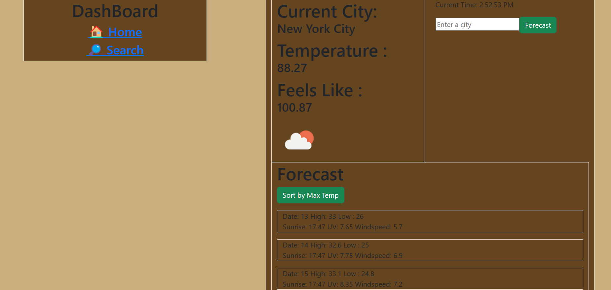
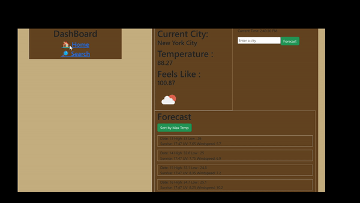
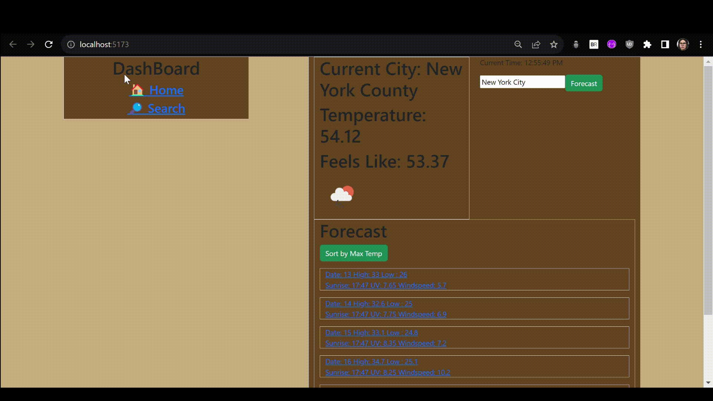

# Web Development Project 5 & 6- _Weather-App_

Submitted by: **Loyd Flores**

This web app: **"Your application provides users with up-to-date weather information for any city. Users can enter a city name, and the app displays current weather conditions and a week-long weather forecast, along with the ability to sort the forecast by maximum temperature."**

Time spent: **5** hours spent in total

## Required Features

The following **required** functionality is completed:

- [🗸] **The list displays a list of data fetched using an API call**
- [🗸] **Data uses the useEffect React hook and async/await syntax**
- [🗸] **The app dashboard includes at least three summary statistics about the data such as**
- [🗸] **A search bar allows the user to search for an item in the fetched data**
- [🗸] **Multiple different filters (2+) allow the user to filter items in the database by specified categories**

The following **additional** features are implemented:

- [🗸] **Mobile Friendly Sizing**
- [🗸] **Built in clock**

## Snippets

## Video Walkthrough

[Watch the Video](https://clipchamp.com/watch/QacA9tfKFOt)

## Project 6 GIF

<!-- Replace this with whatever GIF tool you used! -->

GIF created with gif-convert

Microsoft Clipchamp

## Difficulties

- Routes were the lesson of Unit 6. I implemented the routes on my webpage but the difficulty is I'm making my API pull in my Info.jsx, which is the child component of App.jsx. In order for me to fulfill all the other requirements I needed to send the information from info.jsx to be sent up to app.jsx to be sent down again.

- The layout of my initial project was not easy to debug to setup proper passing of data. It was hard to just convert this into a properly structured routing app.

## License

    Copyright 2023  Lots Flores

    Licensed under the Apache License, Version 2.0 (the "License");
    you may not use this file except in compliance with the License.
    You may obtain a copy of the License at

        http://www.apache.org/licenses/LICENSE-2.0

    Unless required by applicable law or agreed to in writing, software
    distributed under the License is distributed on an "AS IS" BASIS,
    WITHOUT WARRANTIES OR CONDITIONS OF ANY KIND, either express or implied.
    See the License for the specific language governing permissions and
    limitations under the License.
